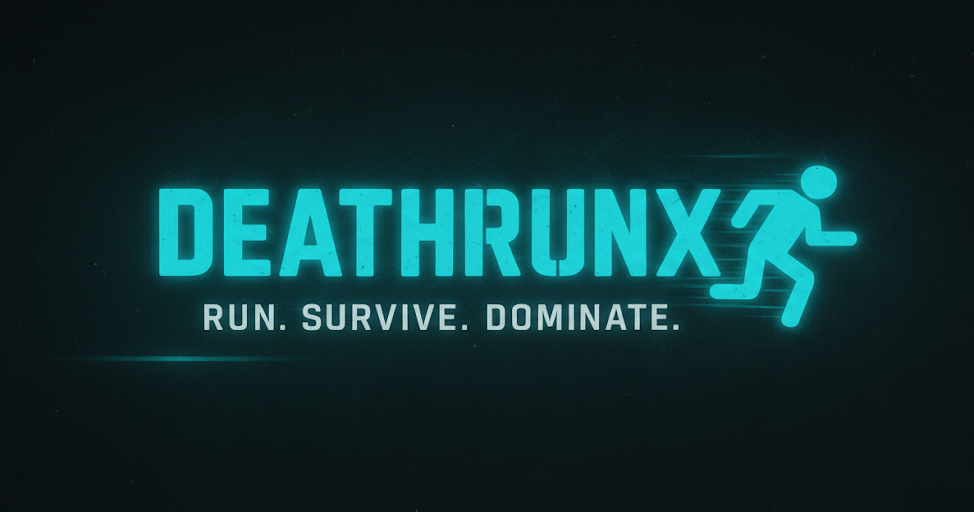

  
  
  
  
  

# DeathrunX Mod for Call of Duty 4: Modern Warfare

A modern take on the classic Death Run game mode where one player becomes the Trap Master, setting deadly traps to eliminate runners who must navigate through an obstacle course to reach the end.

## 🎮 Features

- **Classic Death Run Gameplay**: One Trap Master vs. Runners dynamic
- **Custom Characters**: Including Duke Nukem and other unique models
- **Weapon System**: Tons of custom weapons
- **Ranking System**: Progress through 50 ranks and 10 prestiges with unlockable content for each level & prestige
- **Challenges & Records**: Track your best times and complete challenges
- **Customizable HUD**: Redesigned interface for better gameplay experience
- **Player Cards & Sprays**: Show off your achievements and style
- **Map Voting**: Community-driven map selection

## 🚀 Installation

### Server Installation

1. Download the latest release from [Releases](https://github.com/EthanBurkett/DeathRunX/releases)
2. Extract the contents to your Call of Duty 4 `Mods` directory
3. Launch the server with `+set fs_game Mods/deathrunx`

### Client Installation

1. Join any DeathrunX server to automatically download the mod
2. Or manually install by placing the mod files in your `Mods` directory

## 🎯 Gameplay

### Controls

- **Trap Master**: Set traps using your weapon selection
- **Runners**: Navigate through the course and avoid traps
- **Use** key (default: F) to interact with objects

## 🛠️ Configuration

Edit `deathrun.cfg` in the mod directory to customize:

- Server settings
- Experience rates
- Gameplay modifiers

## 🤝 Contributing

Contributions are welcome! Please read our [contributing guidelines](CONTRIBUTING.md) before submitting pull requests.

## 📜 License

This project is licensed under a custom license. See [LICENSE](LICENSE) for details.

## 📞 Support & Community

- [GitHub Issues](https://github.com/EthanBurkett/DeathRunX/issues)
- [Discord Community](https://discord.gg/DeathrunX)

## 📝 Credits

- **Original Mod**: BraXi's Death Run Mod
- **Maintainers**: Ethan Burkett
- **Special Thanks**: All contributors and testers

---

  Made with ❤️ for the Call of Duty 4 community

